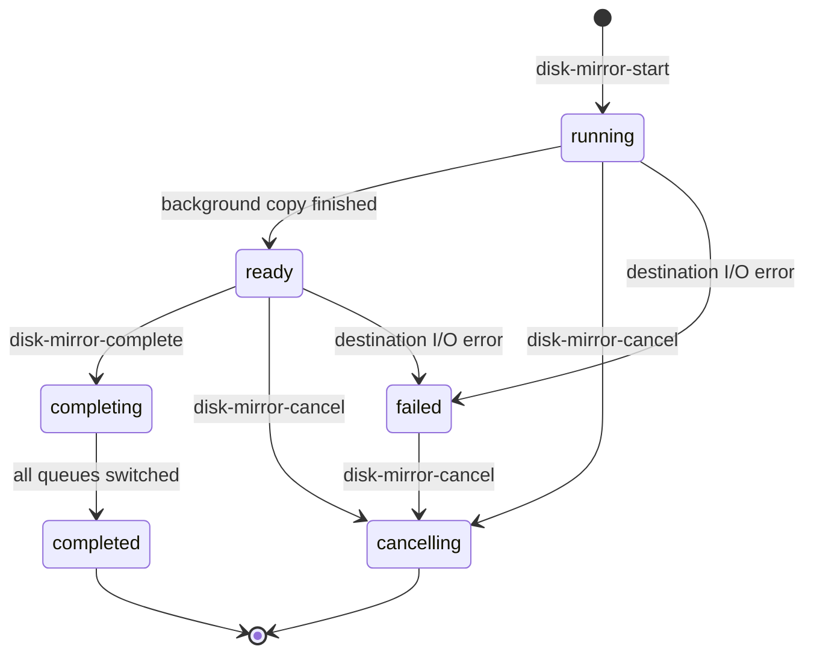
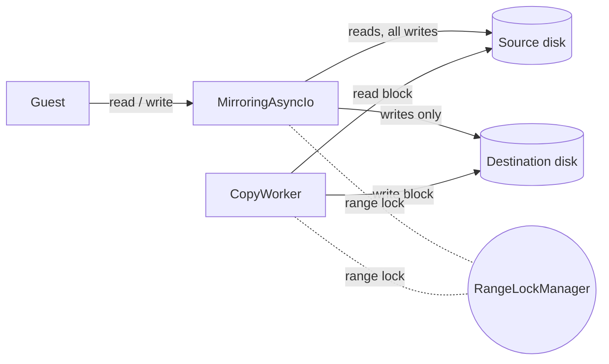

# Disk Mirroring

Disk mirroring copies a running VM's disk to another file on the host and
keeps the two in sync, so the disk image can be moved to a different backing
store without stopping the guest. It is the Cloud Hypervisor counterpart of
QEMU's `blockdev-mirror`.

A typical use is rebalancing storage: when the share backing a disk image
fills up, the operator mirrors that disk onto a file on another share and
switches the VM over to it.

## Overview

Mirroring runs as a sequence of phases driven by four API calls:

- `/vm.disk-mirror-start` begins mirroring a disk onto a destination path.
- `/vm.disk-mirror-status` reports the current phase and copy progress.
- `/vm.disk-mirror-complete` switches the VM over to the destination.
- `/vm.disk-mirror-cancel` aborts and keeps the VM on the source.



While `running`, a background worker copies the existing data block by block.
At the same time every guest write is forwarded to both disks, so once the
copy finishes the two are identical. Reaching `ready` means the two disks are
in sync and stay so until the operator completes or cancels.

## Operator usage

The examples use `curl` against the VMM's API socket. Replace the socket path
and the disk identifier with your own. The disk identifier is the device `id`
shown by `vm.info` (the same `id` used when the disk was configured or hot
added).

### Start a mirror

The destination image must already exist with the same image format and
logical size as the source. Cloud Hypervisor does not create or resize it.

```console
curl --unix-socket /tmp/cloud-hypervisor.sock -i \
     -X PUT 'http://localhost/api/v1/vm.disk-mirror-start' \
     -H 'Content-Type: application/json' \
     -d '{"id": "_disk0", "destination_path": "/new/store/disk0.raw"}'
```

This switches the disk to a mirroring backend and starts the background copy.
The VM keeps serving I/O throughout. A `204` response means mirroring started.

Mirroring supports standalone QCOW2 images. QCOW2 sources and destinations
with backing files are rejected because mirroring copies the full logical
contents and would flatten the image.

### Check progress

```console
curl --unix-socket /tmp/cloud-hypervisor.sock \
     -X PUT 'http://localhost/api/v1/vm.disk-mirror-status' \
     -H 'Content-Type: application/json' \
     -d '{"id": "_disk0"}'
```

The response reports the phase and how far the copy has progressed:

```json
{"phase": "running", "copied_bytes": 1073741824, "total_bytes": 4294967296}
```

`phase` is one of `running`, `ready`, `completing`, `completed`,
`cancelling`, or `failed`. A `failed` status also carries a `failure` field
describing what went wrong. Poll this endpoint until the phase becomes
`ready`.

### Complete the mirror

Once the phase is `ready`, switch the VM over to the destination:

```console
curl --unix-socket /tmp/cloud-hypervisor.sock -i \
     -X PUT 'http://localhost/api/v1/vm.disk-mirror-complete' \
     -H 'Content-Type: application/json' \
     -d '{"id": "_disk0"}'
```

The call blocks until the switch-over finishes. On success (`204`) the VM
serves all I/O from the destination disk and the source disk can be removed.
Completion is only accepted from the `ready` phase. A `404` or `400` leaves the
mirror active, so you can fix the cause and retry.

### Cancel the mirror

At any time before completion the operator can abort and keep the VM on the
source disk:

```console
curl --unix-socket /tmp/cloud-hypervisor.sock -i \
     -X PUT 'http://localhost/api/v1/vm.disk-mirror-cancel' \
     -H 'Content-Type: application/json' \
     -d '{"id": "_disk0"}'
```

The destination disk is released and the VM continues on the source. Cancel is
refused once completion has been requested, because by then a queue may
already be writing only to the destination.

### Failure handling

If the destination disk fails (for example its backing store becomes
unreachable), the mirror moves to `failed` and the affected queues fall back
to serving the guest from the source disk, so the guest keeps running on
intact data. The operator then cancels the failed mirror to release the
destination.

### Unrecoverable errors

Completing a mirror cannot be undone. Once the switch to the destination
begins, some virtqueues may already be writing only to the destination, so
there is no consistent state to roll back to. If a queue cannot be switched
over during completion, the VMM aborts. The alternative would leave the disk
half on the source and half on the destination and could lose acknowledged
writes. This is rare: it needs a queue worker to fail mid-swap (for example an
epoll registration error), or its switch-over command to be lost or
unacknowledged.

### Conflicting operations

While a mirror is active, the VMM rejects operations that would disturb it:
snapshotting, live migration, resizing the disk, removing the device, and
API requests to reboot, shut down, or delete the VM. Complete or cancel the
mirror first. If the guest requests a reboot or shutdown, the VMM stops the
guest but keeps the mirror and API available. The requested lifecycle operation
continues after the operator completes or cancels every active mirror. Pausing
the VM is allowed, but a mirror cannot be started, completed, or cancelled while
the device is paused.

## Implementation details

Mirroring is built from two cooperating pieces and a range lock that keeps
them from corrupting each other:



**CopyWorker.** A background thread copies the source disk to the destination
in 512 KiB blocks. A block that reads back as all zeros is punched as a hole
on the destination instead of being written, so sparse images stay sparse. The
worker updates the copied-byte counter that `vm.disk-mirror-status` reports,
and stops early once the phase becomes terminal.

**MirroringAsyncIo.** When a mirror starts, each virtqueue worker's `AsyncIo`
backend is swapped for a `MirroringAsyncIo`. It forwards reads to the source
and forwards every mutating operation (`write_vectored`, `fsync`,
`punch_hole`, `write_zeroes`) to both the source and the destination. The
completions of the two sides are awaited inside the write call, so an error on
the destination can be handled before the guest sees the write as done. On a
destination error that queue degrades to source passthrough and the mirror
fails, rather than letting the guest diverge from intact data.

**Range lock.** The CopyWorker and the guest writes can target overlapping
byte ranges at the same time. Each side takes an exclusive lock on the range
it is about to touch and holds it until its I/O completes, so a copy and a
guest write to the same region cannot interleave into an inconsistent result.
Lookups are over a small set of held ranges, so the lock is cheap in the
common non-overlapping case.
